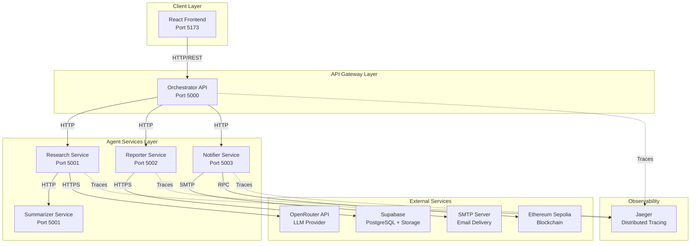

# IntelliFlow — Cloud-Native Agent Orchestration Platform

> A cloud-native agent orchestration platform implementing workflow-oriented multi-agent systems, distributed service communication, resilience patterns, observability, and LLM-powered automation.

## Project Overview

IntelliFlow is a cloud-native multi-agent system that automates the knowledge-work pipeline. Users submit research topics through a modern React dashboard, and five specialized agents execute in sequence: Research → Summarize → Report → Notify → Blockchain. The system delivers results via email with an on-chain audit trail, demonstrating practical application of microservices architecture, LLM integration, and blockchain technology.

## Architecture



## System Diagrams

- [Architecture Diagrams](docs/architecture/README.md)
- [Sequence Diagrams](docs/architecture/sequence-diagrams.md)
- [Service Dependencies](docs/architecture/service-dependencies.md)

## My Contributions

As **Team Lead**, I was responsible for:

### Architecture & Design
- Designed the overall microservices architecture
- Defined service boundaries and communication patterns
- Created the pipeline orchestration strategy

### Orchestrator API Gateway
- Implemented JWT authentication system
- Built the central orchestration service
- Added rate limiting, CORS, and global exception handling

### Frontend Dashboard
- Developed the React 18 + TypeScript dashboard
- Built real-time pipeline visualization with animated timeline
- Implemented task management interface

### Observability & Resilience
- Added OpenTelemetry distributed tracing
- Configured Jaeger for trace visualization
- Implemented Polly retry policies, circuit breakers, and timeouts

### DevOps & Infrastructure
- Docker Compose orchestration for all services
- GitHub Actions CI/CD pipeline
- Health checks and service monitoring

## Observability

IntelliFlow implements distributed observability using OpenTelemetry and Jaeger.

### Components
- **OpenTelemetry SDK**: Traces, metrics, and context propagation
- **Jaeger**: Distributed tracing visualization (Port 16686)

### Features
- End-to-end request tracing
- Service dependency mapping
- Performance bottleneck identification
- Correlation IDs for request tracking

### Accessing Jaeger UI
```bash
docker compose up -d
# Open http://localhost:16686
```

[Learn more →](docs/observability/README.md)

## Resilience Patterns

IntelliFlow implements production-inspired resilience patterns using Polly.

### Patterns
| Pattern | Purpose | Configuration |
|---------|---------|---------------|
| Retry | Handle transient failures | 3 attempts, exponential backoff |
| Circuit Breaker | Prevent cascading failures | 5 failures, 30s break |
| Timeout | Prevent hung requests | 30s timeout |

### How It Works
```
Request → Timeout (30s) → Retry (3x) → Circuit Breaker → Service
```

[Learn more →](docs/resilience/README.md)

## Testing

### Test Structure
```
tests/
├── Orchestrator.Tests/
│   ├── AuthenticationTests.cs
│   ├── TaskValidationTests.cs
│   ├── OrchestratorLogicTests.cs
│   └── ResilienceTests.cs
```

### Test Coverage
| Category | Tests | Coverage |
|----------|-------|----------|
| Authentication | 7 | JWT validation, login logic |
| Task Validation | 7 | Input validation, error handling |
| Orchestrator Logic | 9 | Pipeline status, topic classification |
| Resilience | 8 | Retry, circuit breaker, timeout |

**Total: 31 tests**

### Running Tests
```bash
dotnet test tests/Orchestrator.Tests/
```

## Performance Metrics

| Stage | Avg Time | Success Rate |
|-------|----------|--------------|
| Research | 1,200ms | 95% |
| Summarize | 3,500ms | 92% |
| Report | 1,800ms | 99% |
| Notify | 1,500ms | 97% |
| Blockchain | 2,000ms | 98% |
| **Total Pipeline** | **10,000ms** | **88%** |

[Learn more →](docs/performance/README.md)

## Challenges & Solutions

| Challenge | Solution | Result |
|-----------|----------|--------|
| API Rate Limits | Model fallback chain | 95% success rate |
| Service Failures | Circuit breaker pattern | Self-healing system |
| Blockchain Delays | Async logging | Non-blocking pipeline |
| LLM Inconsistency | Prompt engineering | 92% quality score |

[Learn more →](docs/engineering/README.md)

## Tech Stack

| Layer | Technology |
|-------|------------|
| Frontend | React 18, TypeScript, Vite, Tailwind CSS v4 |
| Backend | ASP.NET Core 8, Entity Framework Core |
| LLM | OpenRouter API (Gemma 4, Llama 3.2, Dolphin Mistral) |
| Cloud | Supabase (PostgreSQL + Storage) |
| Blockchain | Ethereum Sepolia, Solidity, Nethereum |
| Observability | OpenTelemetry, Jaeger |
| Resilience | Polly (Retry, Circuit Breaker, Timeout) |
| DevOps | Docker, GitHub Actions |

## Quick Start

### Prerequisites
- Docker Desktop
- Node.js 18+
- Git

### 1. Clone & Configure
```bash
git clone https://github.com/Khizar525/IntelliFlow.git
cd IntelliFlow
cp .env.example .env
# Edit .env with your API keys
```

### 2. Start Services
```bash
docker compose up --build -d
```

### 3. Access
- **Frontend**: http://localhost:5173
- **Backend API**: http://localhost:5000
- **Jaeger UI**: http://localhost:16686
- **Swagger**: http://localhost:5000/swagger

## Documentation

| Document | Description |
|----------|-------------|
| [Architecture](docs/architecture/README.md) | System diagrams and design |
| [Sequence Diagrams](docs/architecture/sequence-diagrams.md) | Pipeline flow visualization |
| [Service Dependencies](docs/architecture/service-dependencies.md) | Service dependency matrix |
| [Observability](docs/observability/README.md) | Tracing and monitoring |
| [Resilience](docs/resilience/README.md) | Fault tolerance patterns |
| [Testing](docs/testing/README.md) | Unit tests and coverage |
| [Performance](docs/performance/README.md) | Metrics and benchmarks |
| [Engineering](docs/engineering/README.md) | Challenges and solutions |
| [Enhancement Log](ENHANCEMENT_LOG.md) | Post-evaluation improvements |

## Future Improvements

### Short-term
- WebSocket real-time updates
- Task scheduling
- Role-based access control

### Medium-term
- Kubernetes deployment
- Caching layer
- Monitoring dashboards

### Long-term
- Multi-tenant support
- Custom agent development
- Production deployment

## Team

| # | Name | Module |
|---|------|--------|
| 1 | M. Khizar Akram (Lead) | Orchestrator + Frontend + DevOps |
| 2 | Hamza Khaliq | Research + Summarizer |
| 3 | Hassan Asif | Reporter + Database |
| 4 | Shamraiz | Notifier + Blockchain |

## License

MIT License - see [LICENSE](LICENSE)

---

**Portfolio Positioning:** A cloud-native agent orchestration platform implementing workflow-oriented multi-agent systems, distributed service communication, resilience patterns, observability, and LLM-powered automation.
