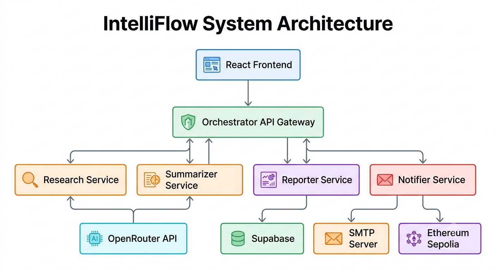
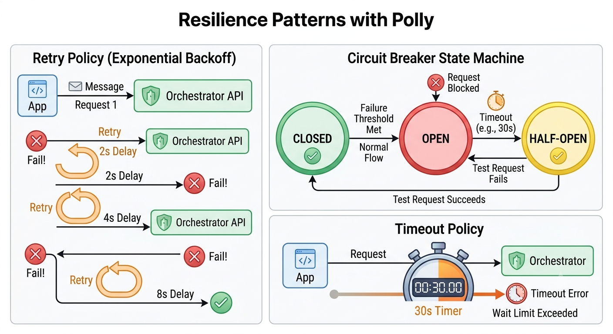
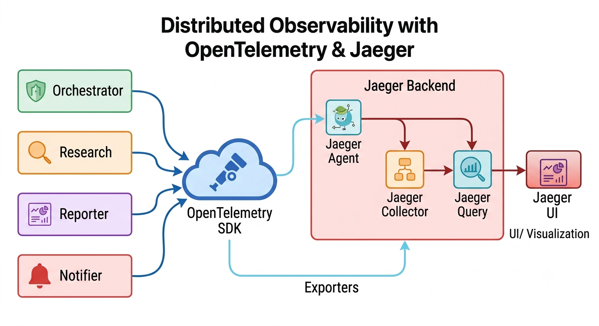
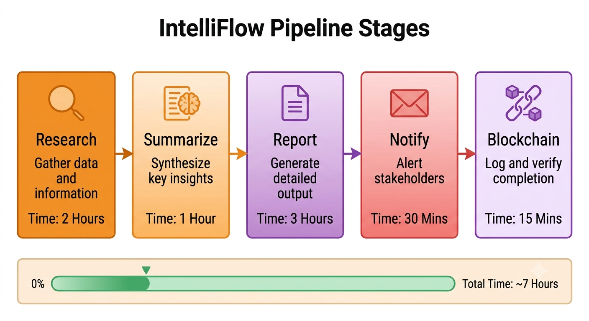

# System Architecture

## High-Level Architecture Diagram

## Sequence Diagram

## Service Dependencies

## Resilience Patterns

## Observability Architecture

## Pipeline Flow

---

**Last Updated:** June 2026  
**Author:** M. Khizar Akram
