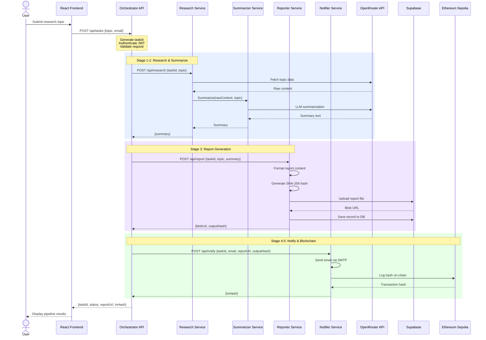
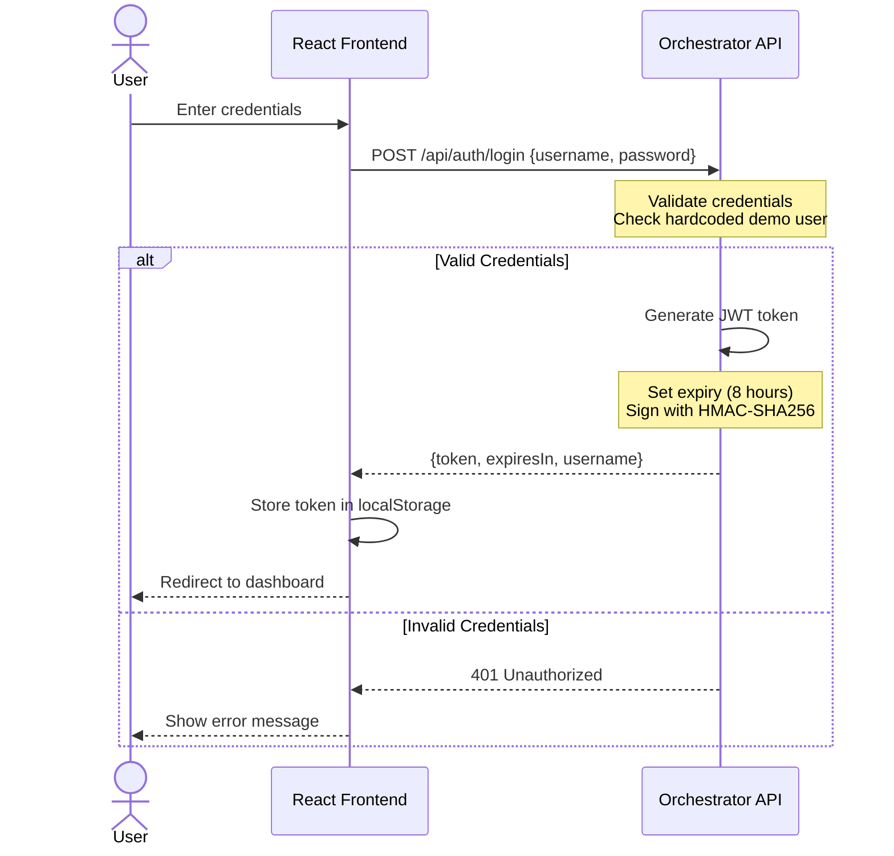
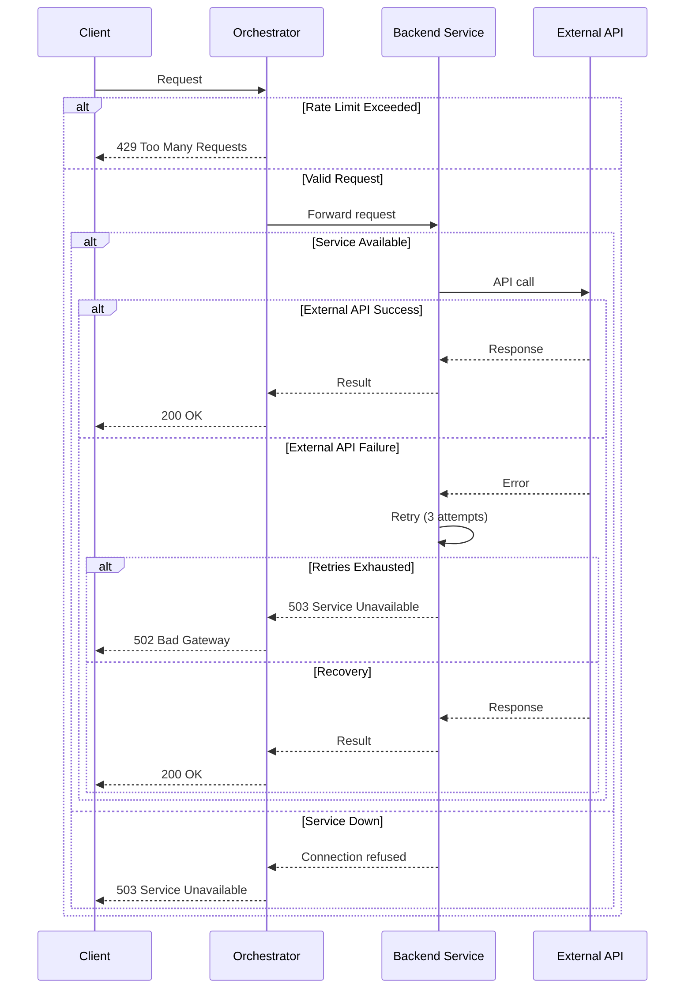
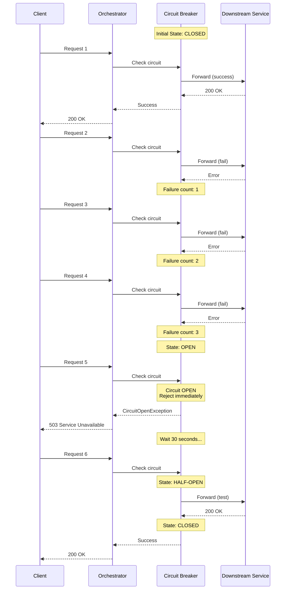

# Sequence Diagrams

## Pipeline Execution Sequence

## Authentication Sequence

## Error Handling Sequence

## Circuit Breaker Sequence

---

**Last Updated:** June 2026  
**Author:** M. Khizar Akram
