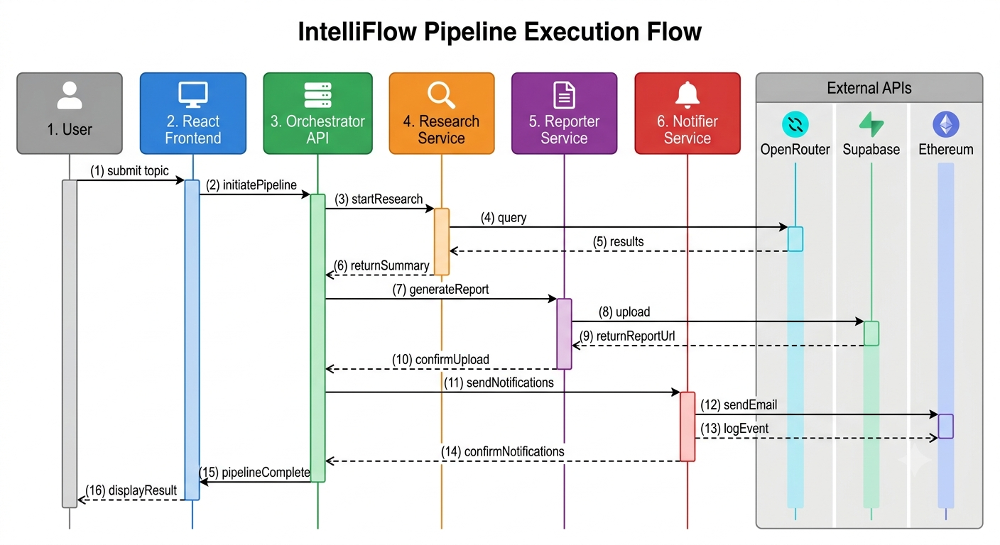

# Sequence Diagrams

## Pipeline Execution Sequence

## Detailed Sequence Diagrams

### Pipeline Flow

The complete pipeline execution follows this sequence:

1. **User submits topic** → React Frontend → Orchestrator API
2. **Research Stage** → Orchestrator → Research Service → OpenRouter API
3. **Report Stage** → Orchestrator → Reporter Service → Supabase
4. **Notification Stage** → Orchestrator → Notifier Service → SMTP + Blockchain
5. **Results returned** → Orchestrator → Frontend → User

### Authentication Flow

1. **Login request** → User enters credentials
2. **Validation** → Orchestrator validates credentials
3. **Token generation** → JWT token created with expiry
4. **Storage** → Token stored in localStorage
5. **Redirect** → User redirected to dashboard

### Error Handling Flow

1. **Rate limiting** → Excessive requests blocked (429)
2. **Service failures** → Automatic retry (3 attempts)
3. **Circuit breaker** → Opens after 5 failures
4. **Fallback** → Graceful degradation

### Circuit Breaker States

1. **Closed** → Normal operation, requests flow through
2. **Open** → Circuit tripped, requests fail immediately
3. **Half-Open** → Testing if service recovered

---

**Last Updated:** June 2026  
**Author:** M. Khizar Akram
