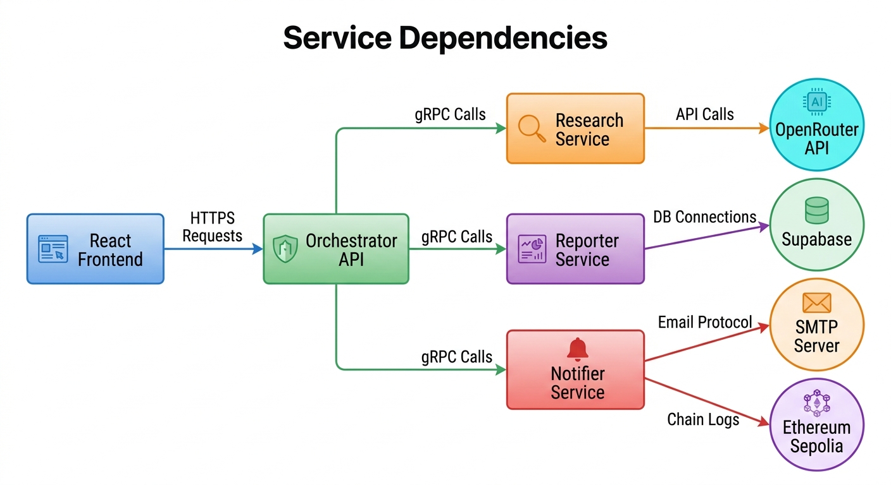

# Service Dependencies

## Service Dependency Matrix

| Service | Depends On | External Dependencies |
|---------|------------|----------------------|
| React Frontend | Orchestrator API | None |
| Orchestrator | Research, Reporter, Notifier | None |
| ResearchSummarizer | None | OpenRouter API |
| Reporter | None | Supabase (PostgreSQL + Storage) |
| Notifier | None | SMTP Server, Ethereum Sepolia |

## Dependency Graph

## Port Mapping

| Service | Internal Port | External Port | Protocol |
|---------|---------------|---------------|----------|
| React Frontend | 5173 | 5173 | HTTP |
| Orchestrator API | 8080 | 5000 | HTTP |
| ResearchSummarizer | 8080 | 5001 | HTTP |
| Reporter | 8080 | 5002 | HTTP |
| Notifier | 8080 | 5003 | HTTP |
| Jaeger UI | 16686 | 16686 | HTTP |
| Jaeger Agent | 6831 | 6831 | UDP |

## Environment Variables

### Orchestrator
| Variable | Description | Example |
|----------|-------------|---------|
| JWT_SECRET | JWT signing key | your_super_secret_key |
| JWT_ISSUER | Token issuer | IntelliFlow |
| JWT_AUDIENCE | Token audience | IntelliFlowClients |
| RESEARCH_SERVICE_URL | Research service URL | http://researchsummarizer:5001 |
| REPORTER_SERVICE_URL | Reporter service URL | http://reporter:5002 |
| NOTIFIER_SERVICE_URL | Notifier service URL | http://notifier:5003 |

### ResearchSummarizer
| Variable | Description | Example |
|----------|-------------|---------|
| OPENROUTER_API_KEY | OpenRouter API key | sk-or-... |
| OPENROUTER_MODEL | Primary LLM model | google/gemma-4-26b-a4b-it:free |

### Reporter
| Variable | Description | Example |
|----------|-------------|---------|
| SUPABASE_DB_CONNECTION | PostgreSQL connection string | Host=...;Database=... |
| SUPABASE_URL | Supabase project URL | https://xxx.supabase.co |
| SUPABASE_ANON_KEY | Supabase anonymous key | eyJ... |

### Notifier
| Variable | Description | Example |
|----------|-------------|---------|
| SMTP_HOST | SMTP server host | smtp.gmail.com |
| SMTP_PORT | SMTP server port | 587 |
| SMTP_USER | SMTP username | user@gmail.com |
| SMTP_PASSWORD | SMTP password | app_password |
| ALCHEMY_RPC_URL | Ethereum RPC URL | https://eth-sepolia.g.alchemy.com/v2/... |
| ETH_PRIVATE_KEY | Wallet private key | 0x... |
| AUDIT_CONTRACT_ADDRESS | Smart contract address | 0x... |

---

**Last Updated:** June 2026  
**Author:** M. Khizar Akram
