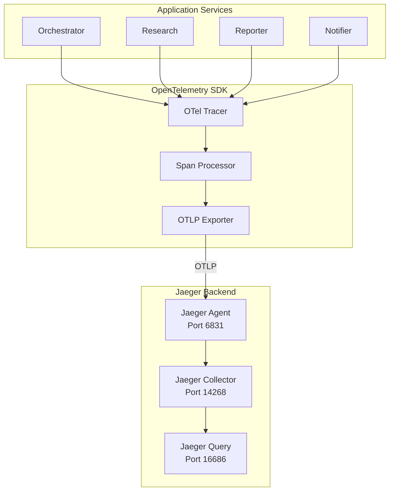

# Observability

## Overview

IntelliFlow implements distributed observability using OpenTelemetry for tracing and Jaeger for visualization. This enables end-to-end visibility across all microservices.

## Architecture



## Components

### OpenTelemetry SDK
- **Tracing**: Captures distributed traces across services
- **Metrics**: Collects performance metrics
- **Context Propagation**: Maintains trace context across service boundaries

### Jaeger
- **Agent**: Receives spans from application services (UDP:6831)
- **Collector**: Processes and stores spans
- **Query**: Provides API for trace retrieval
- **UI**: Web interface for trace visualization (Port 16686)

## Trace Structure

Each trace contains:
- **Trace ID**: Unique identifier for the entire request
- **Span ID**: Unique identifier for each operation
- **Service Name**: Which service generated the span
- **Operation Name**: What operation was performed
- **Timestamp**: When the operation started
- **Duration**: How long the operation took
- **Attributes**: Key-value metadata

## Example Trace

```
Trace ID: abc123def456
├── Span 1: Orchestrator.POST /api/tasks (1250ms)
│   ├── Span 2: HTTP POST ResearchSummarizer (800ms)
│   │   ├── Span 3: DuckDuckGo API Call (200ms)
│   │   └── Span 4: OpenRouter LLM Call (500ms)
│   ├── Span 5: HTTP POST Reporter (300ms)
│   │   ├── Span 6: Supabase Upload (150ms)
│   │   └── Span 7: SHA-256 Hash (10ms)
│   └── Span 8: HTTP POST Notifier (200ms)
│       ├── Span 9: SMTP Send (100ms)
│       └── Span 10: Ethereum TX (100ms)
```

## Configuration

### Environment Variables

| Variable | Description | Default |
|----------|-------------|---------|
| OTEL_EXPORTER_OTLP_ENDPOINT | Jaeger OTLP endpoint | http://localhost:4317 |
| OTEL_SERVICE_NAME | Service name | orchestrator |
| OTEL_RESOURCE_ATTRIBUTES | Resource attributes | - |

### Docker Compose

All services are configured to export traces to Jaeger:

```yaml
environment:
  - OTEL_EXPORTER_OTLP_ENDPOINT=http://jaeger:4317
  - OTEL_SERVICE_NAME=orchestrator
  - OTEL_RESOURCE_ATTRIBUTES=service.owner=khizar,service.module=1
```

## Accessing Jaeger UI

1. Start the services: `docker compose up -d`
2. Open browser: `http://localhost:16686`
3. Select a service from the dropdown
4. Click "Find Traces" to view traces

## Filtering Traces

### By Service
Select a specific service from the service dropdown in Jaeger UI.

### By Duration
Use the "Min Duration" and "Max Duration" filters to find slow traces.

### By Tag
Filter by custom attributes like:
- `service.owner=khizar`
- `service.module=1`
- `http.method=POST`

## Best Practices

### 1. Meaningful Span Names
Use descriptive operation names:
```csharp
using var span = PipelineActivitySource.StartActivity("Research.FetchContent");
```

### 2. Add Attributes
Enrich spans with useful metadata:
```csharp
span?.SetTag("topic", request.Topic);
span?.SetTag("task.id", taskId);
```

### 3. Record Exceptions
Capture exceptions for debugging:
```csharp
catch (Exception ex)
{
    span?.RecordException(ex);
    span?.SetStatus(Status.Error);
    throw;
}
```

### 4. Context Propagation
Ensure trace context flows across service boundaries by using HttpClient with OpenTelemetry instrumentation.

## Troubleshooting

### No Traces Appearing
1. Verify Jaeger is running: `docker compose ps jaeger`
2. Check OTEL_EXPORTER_OTLP_ENDPOINT environment variable
3. Check Jaeger logs: `docker compose logs jaeger`

### Incomplete Traces
1. Ensure all services have OpenTelemetry configured
2. Check network connectivity between services
3. Verify trace context propagation in HTTP calls

### High Memory Usage
1. Reduce sampling rate in development
2. Use probabilistic sampling for production
3. Configure span limits

---

**Last Updated:** June 2026  
**Author:** M. Khizar Akram
